# Segmentación en Videos 📸
Desarrollo y aplicación de la segmentación de objetos que se mueven o aparecen en escena en datos de entrada de tipo video.

## Detección de cambios en video
El algoritmo para detectar cambios en una secuencia
de video mediante la sustracción de imágenes consta
de cinco pasos fundamentales:

1. Guardar Imagen de Referencia: Se tomó el primer frame del video como punto de referencia, crucial para comparar los cambios en los frames subsiguientes.

2. Capturar Imagen Actual: En un bucle, se procesó cada frame del video, lo que permitió analizar el movimiento a lo largo del tiempo.

3. Realizar Sustracción de Imágenes: Se calculó la diferencia entre la imagen de referencia y cada frame, lo que resaltó las áreas de cambio o movimiento.

4. Umbralizar: Se implementó una función de umbralización manual para convertir la imagen diferenciada en una imagen binaria, facilitando así la identificación de movimientos significativos.

5. Filtrar Ruido: Se utilizaron operaciones morfológicas para refinar la imagen resultante, eliminando elementos irrelevantes y destacando los objetos en movimiento.

## Resultados

### Segmentación del video

En las Figuras, se muestra una imagen de ejemplo para cada uno de los videos, donde se observa la segmentación de los mismos, respectivamente.

<table>
  <tr>
    <td align="center">
      
    </td>
    <td align="center">
      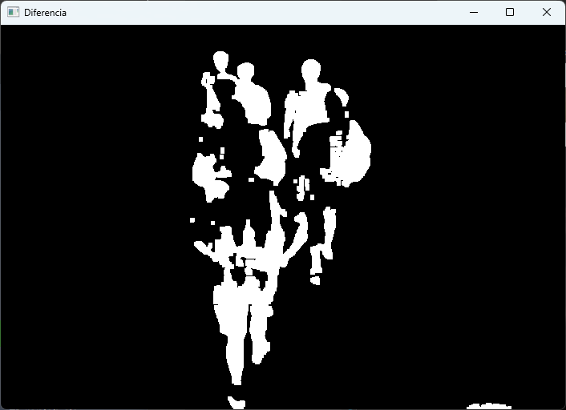
    </td>
    <td align="center">
      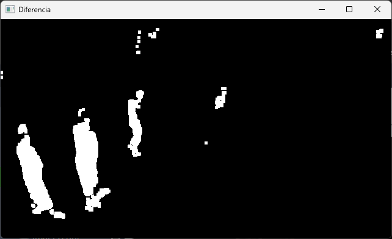
    </td>
  </tr>
  <tr>
    <td align="center">
      Video 'nofi001'
    </td>
    <td align="center">
      Video 'nofi069'
    </td>
    <td align="center">
      Video 'nofi006'
    </td>
  </tr>
</table>

### Filtrado de objetos

Las Figuras presentan imágenes que muestran la manera en que se filtran los objetos del video segmentado.

<table>
  <tr>
    <td align="center">
      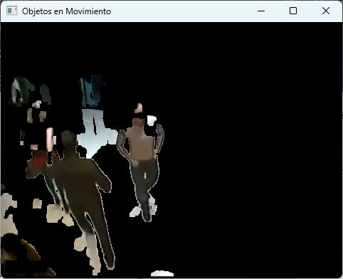
    </td>
    <td align="center">
      
    </td>
    <td align="center">
      
    </td>
  </tr>
  <tr>
    <td align="center">
      Video 'nofi001'
    </td>
    <td align="center">
      Video 'nofi069'
    </td>
    <td align="center">
      Video 'nofi006'
    </td>
  </tr>
</table>

### Filtrado del fondo

Las Figuras presentan imágenes que muestran la manera en que se filtra el fondo del video segmentado.

<table>
  <tr>
    <td align="center">
      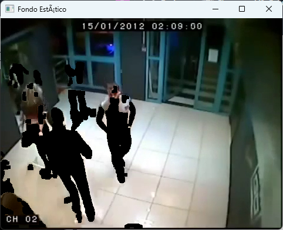
    </td>
    <td align="center">
      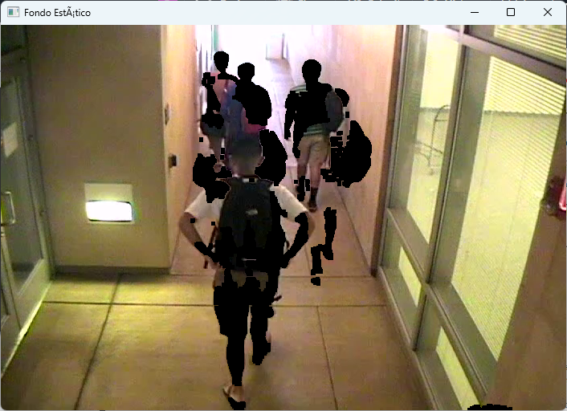
    </td>
    <td align="center">
      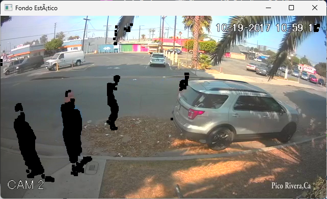
    </td>
  </tr>
  <tr>
    <td align="center">
      Video 'nofi001'
    </td>
    <td align="center">
      Video 'nofi069'
    </td>
    <td align="center">
      Video 'nofi006'
    </td>
  </tr>
</table>

### Fondo resultante

Las Figuras representan el fondo resultante mediante la acumulación de frames en los que no se detectaron cambios para el fondo.

<table>
  <tr>
    <td align="center">
      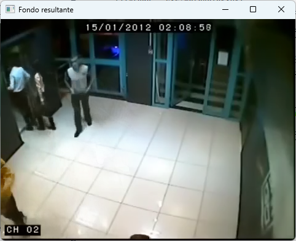
    </td>
    <td align="center">
      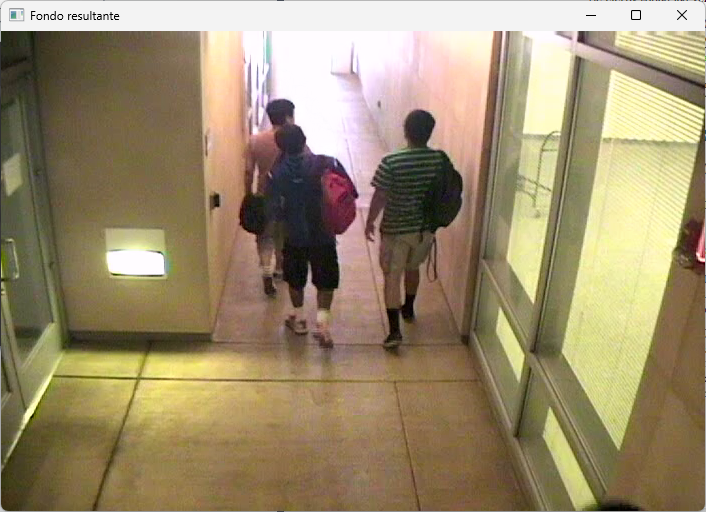
    </td>
    <td align="center">
      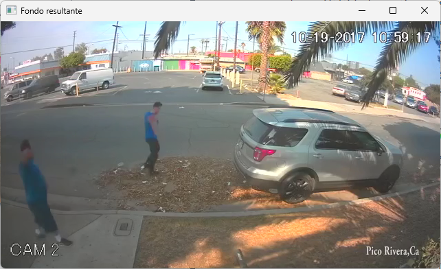
    </td>
  </tr>
  <tr>
    <td align="center">
      Video 'nofi001'
    </td>
    <td align="center">
      Video 'nofi069'
    </td>
    <td align="center">
      Video 'nofi006'
    </td>
  </tr>
</table>

### Objetos resultantes

Finalmente, en las Figuras se visualizan los objetos resultantes mediante la acumulación de frames en los que se detectaron cambios para los objetos en movimiento.

<table>
  <tr>
    <td align="center">
      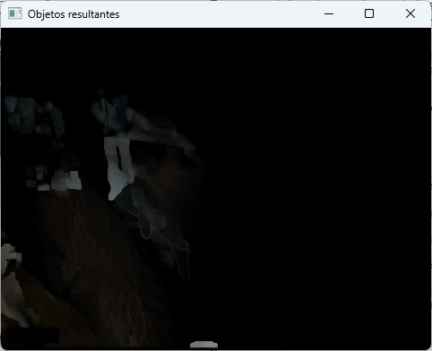
    </td>
    <td align="center">
      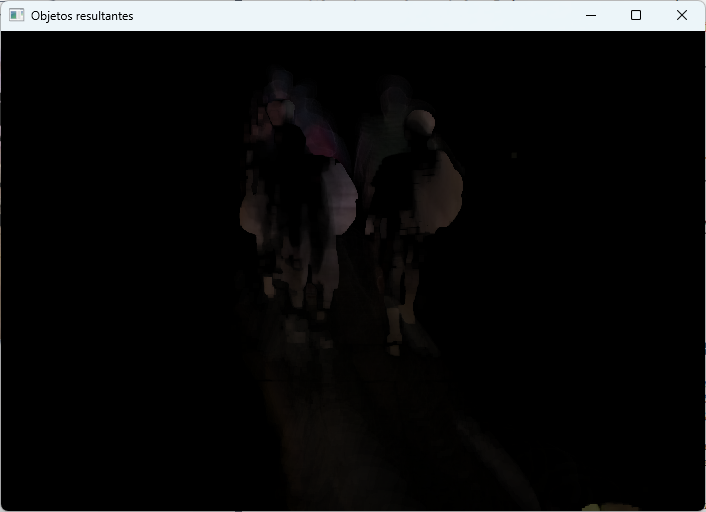
    </td>
    <td align="center">
      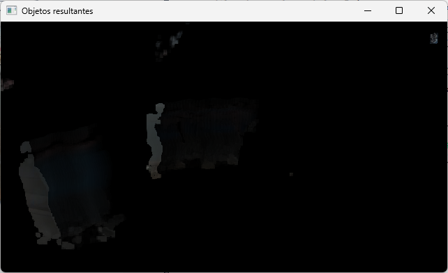
    </td>
  </tr>
  <tr>
    <td align="center">
      Video 'nofi001'
    </td>
    <td align="center">
      Video 'nofi069'
    </td>
    <td align="center">
      Video 'nofi006'
    </td>
  </tr>
</table>

## Cómo Usar el Programa

Aquí te proporcionamos instrucciones sobre cómo utilizar nuestro programa:
1. Clona este repositorio en tu máquina local.
2. Asegúrate de tener Python y las bibliotecas necesarias instaladas.
3. Ejecuta el programa y proporciona una imagen en escala de grises como entrada.
4. El programa aplicará las técnicas de segmentación en los videos  y mostrará los resultados utilizando cv2.

## Autores

Este proyecto fue realizado por un equipo de estudiantes:

| [ Aranza Michelle Gutierrez Jimenez](https://github.com/AranzaMich) |  [ Evelyn Solano Portillo](https://github.com/Eveeelyyyn) |  [ Marco Castelan Rosete](https://github.com/marco2220x) | [ Daniel Vega Rodríguez](https://github.com/DanVer2002) |
| :---: | :---: | :---: | :---: |
